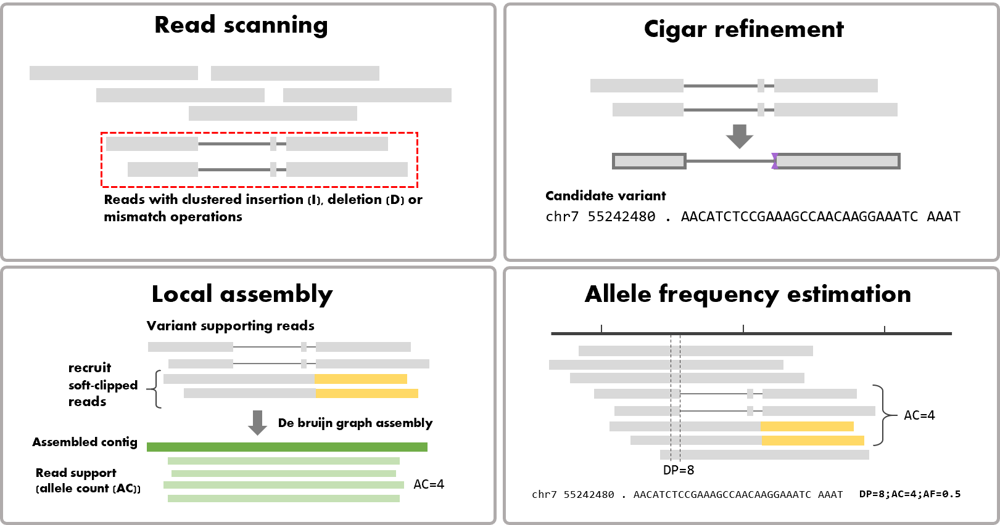

#RivIndel
IN CONSTRUCTION!

RivIndel detects complex indels from targeted sequencing (Illumina).
RivIndel scans every targeted region (supplied as a BED file) to identify potential complex indels.

## Method overview


## Install RivIndel locally

1. Clone RivIndel repository:
```
git clone https://github.com/bdolmo/RivIndel.git
cd RivIndel/
```

2. Execute setup.py
```
python3 setup.py install
```
